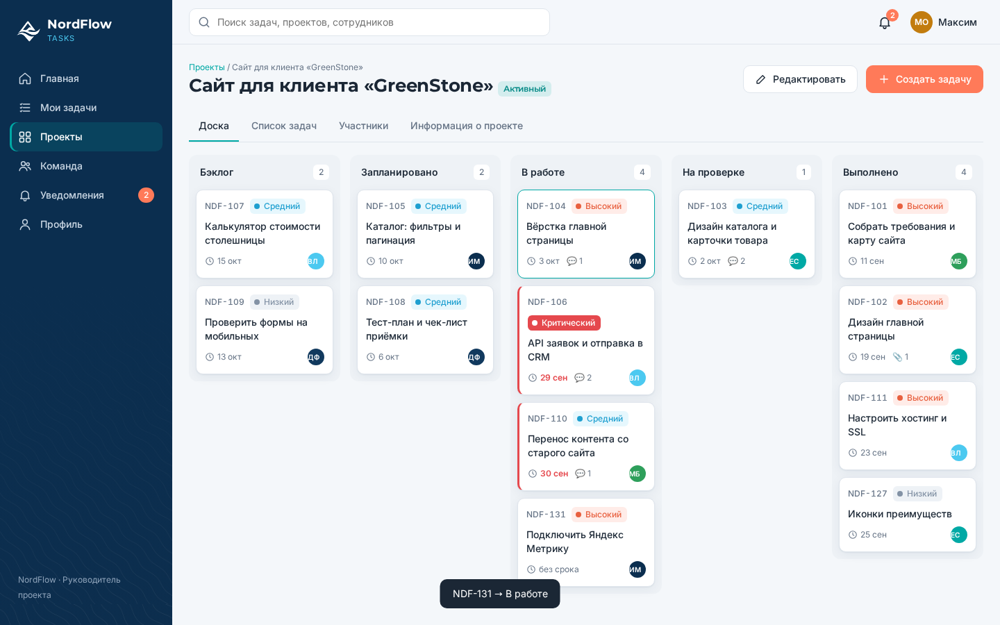
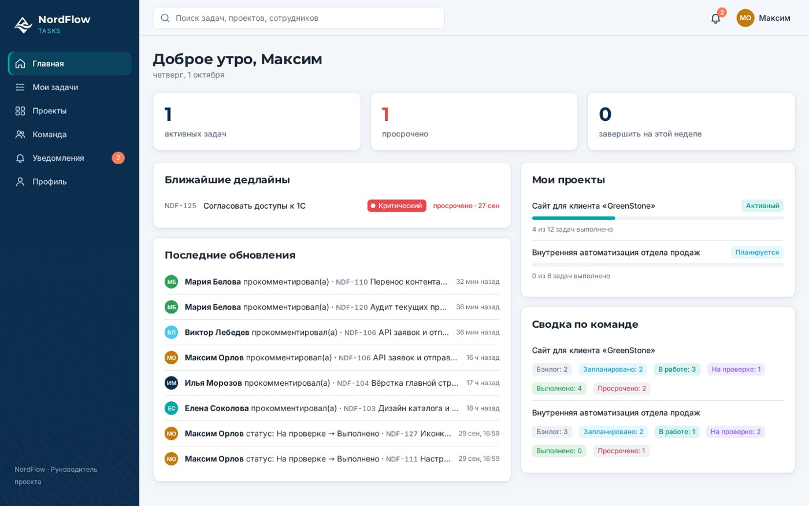
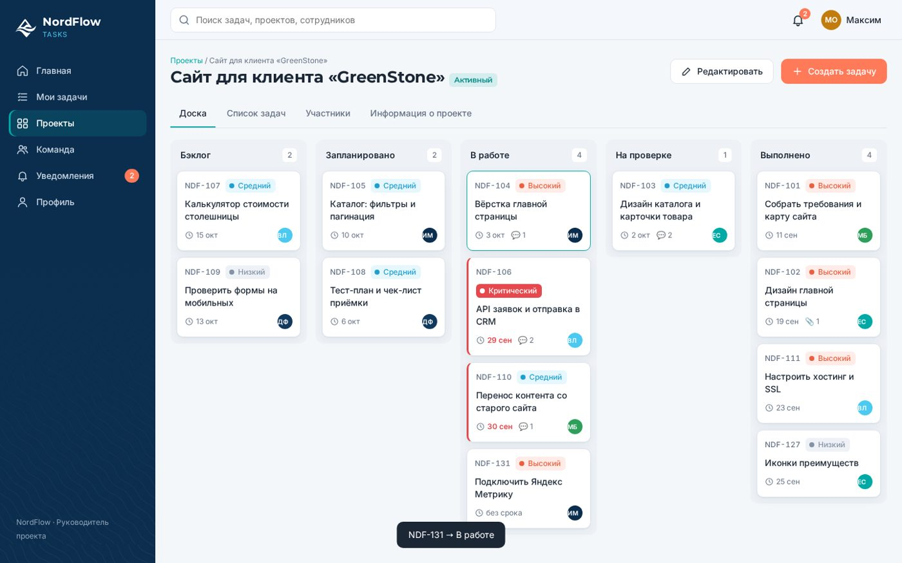
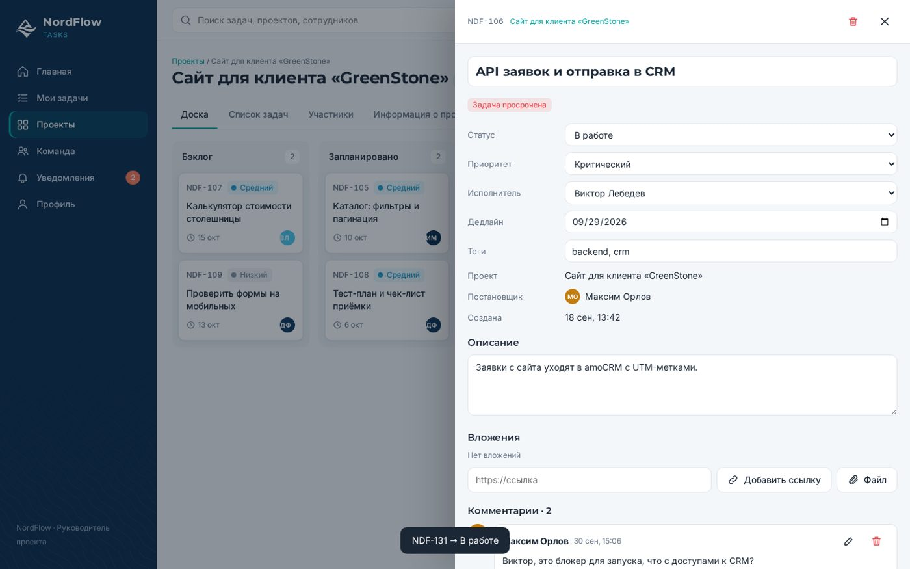
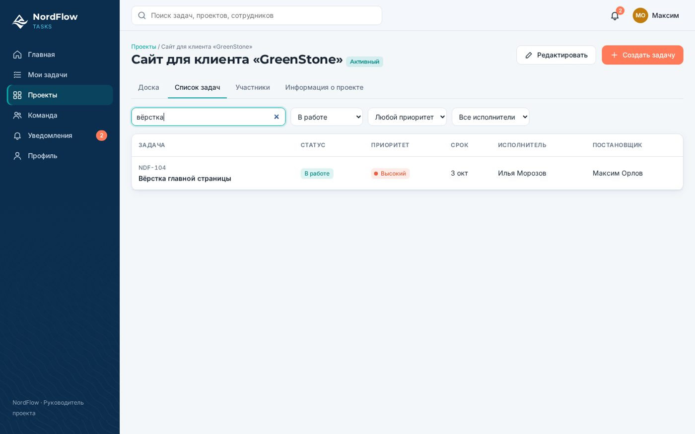
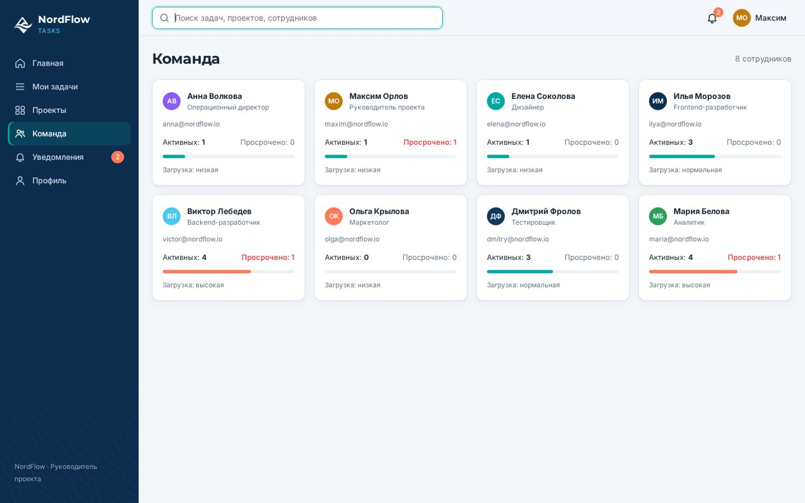
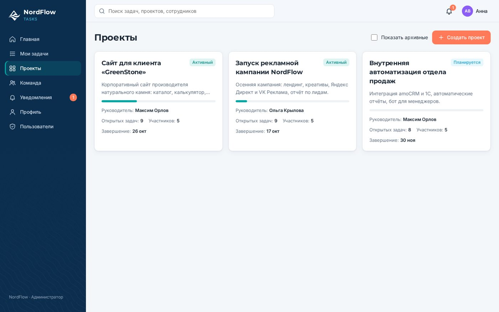
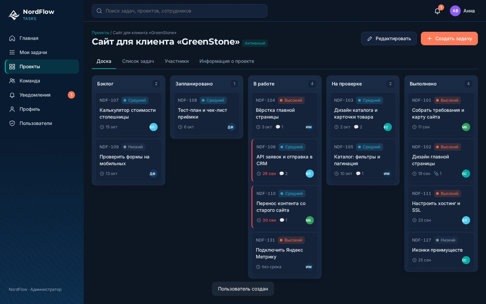
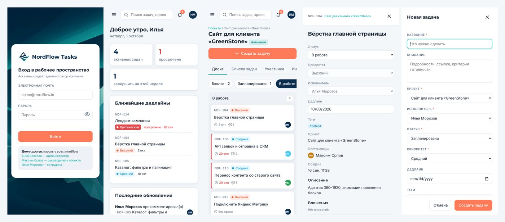

# NordFlow Tasks

Внутренний трекер проектов и задач для компании NordFlow (MVP по ТЗ заказчика).
Проще Jira: проекты, канбан-доска, задачи, комментарии, уведомления, команда.

**Демо:** https://nordflow-tasks-production-5514.up.railway.app — вход `maxim@nordflow.io` / `nordflow`



## Возможности

- Вход по почте и паролю, сессия сохраняется после обновления страницы.
- Три роли: **администратор**, **руководитель проекта**, **сотрудник** — у каждой свои права.
- Главная: активные, просроченные и задачи на неделю, ближайшие дедлайны, лента обновлений, сводка по команде.
- «Мои задачи»: список или доска, фильтры по статусу, проекту, приоритету, сроку, только просроченные, поиск.
- Проекты: карточки, создание и редактирование, участники, статусы (планируется, активный, приостановлен, завершён, архивный).
- Kanban-доска с перетаскиванием карточек: статус меняется автоматически. На телефоне — переключение колонок.
- Задача: идентификатор NDF-xxx, приоритет цветом, дедлайн, теги, ссылки и файлы, история изменений, комментарии.
- Уведомления внутри приложения: назначение, смена срока и статуса, новый комментарий, близкий дедлайн, просрочка.
- Команда: загрузка сотрудников, активные и просроченные задачи.
- Профиль: имя, должность, фото, смена пароля, светлая и тёмная тема.
- Глобальный поиск по проектам, задачам и сотрудникам.
- Адаптивная вёрстка: компьютер, планшет, смартфон.
- Оформление по брендбуку NordFlow: Deep Fjord, Aurora Teal, Northern Sun; шрифты Montserrat и Inter.

## Демо-доступ

Пароль у всех демо-пользователей: `nordflow`

| Роль | Почта |
|---|---|
| Администратор | anna@nordflow.io |
| Руководитель проекта | maxim@nordflow.io, olga@nordflow.io |
| Сотрудник | ilya@nordflow.io, elena@nordflow.io, victor@nordflow.io, dmitry@nordflow.io, maria@nordflow.io |

## Запуск локально

Нужен Node.js 18 или новее. Внешних зависимостей нет.

```bash
npm start            # http://localhost:3000
npm run reset        # стереть данные и заново создать демо
```

## Публикация на Railway

1. Загрузить репозиторий на GitHub.
2. В Railway: New Project → Deploy from GitHub repo → выбрать репозиторий. Команда запуска `npm start` подхватится сама.
3. Settings → Networking → Generate Domain — появится публичная ссылка.
4. Чтобы данные не стирались при перезапуске, добавить Volume (например, `/data`) и переменную `DATA_DIR=/data`.

## Устройство

- `server.js` — HTTP-сервер и API на чистом Node.js, пароли хешируются (scrypt), сессии в cookie HttpOnly.
- `seed.js` — демо-данные: 8 пользователей, 3 проекта, 30 задач, комментарии и история.
- `public/` — интерфейс без фреймворков: `index.html`, `styles.css`, `app.js`, шрифты и картинки бренда.
- Данные хранятся в `data/db.json`, файлы задач — в `data/files/` (до 3 МБ на файл).

## Для кого и какую задачу решает

**Пользователь:** команда небольшой компании (по ТЗ — студия на 35 человек): руководители проектов и сотрудники.  
**Боль:** задачи разбросаны по чатам и таблицам, сроки срываются, непонятно, кто чем загружен; Jira — слишком сложно.  
**Решение:** простой трекер: проекты, канбан, задачи с исполнителем и сроком, комментарии, уведомления и загрузка команды.

## Стек

Node.js без внешних зависимостей, хранение в JSON, интерфейс на HTML/CSS/JavaScript без фреймворков, оформление по брендбуку
заказчика, деплой — Railway. Разработка — вайб-кодинг в Claude Code.

## Скриншоты

| | |
|---|---|
| **Главная руководителя** | **Канбан-доска** |
|  |  |
| **Карточка задачи** | **Список с фильтрами** |
|  |  |
| **Команда и загрузка** | **Проекты** |
|  |  |
| **Тёмная тема** | **Версия для телефона** |
|  |  |
